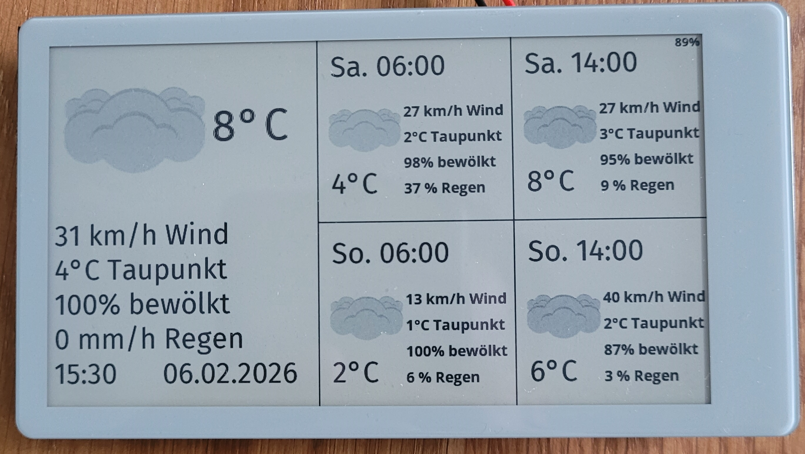

# 🌦️ E-Paper Weather Station (LilyGo T5-4.7 S3)

A high-contrast, low-power weather dashboard built on the **LilyGo T5-4.7 S3** E-Paper display. This project fetches real-time weather data and forecasts via MQTT, displays them using a custom 16-level grayscale UI, and enters deep sleep for extended battery life.



---

## ✨ Features

*   **Hardware:** LilyGo T5-4.7 inch E-Paper Display (ESP32-S3, 960x540px)
*   **Deep Sleep Architecture:**
    *   **Active time:** ~5 seconds per update
    *   **Sleep current:** ~20µA
    *   **Battery Life:** Pretty long
*   **Smart Forecast Window:**
    *   **Morning (< 6:00):** Shows today's 6:00, 14:00 & tomorrow's forecasts
    *   **Day (6:00-14:00):** Shows today's 14:00 & full tomorrow
    *   **Evening (> 14:00):** Shows full tomorrow & day after tomorrow
*   **Custom Icons:** 16-level grayscale weather icons optimized for E-Ink
* **Weather Data:** Powered by **BrightSky API** (DWD Open Data)
---

## 🏗️ System Architecture

This is a two-part system:
```
┌─────────────────┐      ┌──────────────┐      ┌─────────────────┐
│  BrightSky API  │─────>│ Python Script│─────>│  MQTT Broker    │
│  (DWD Data)     │ JSON │(Home Server) │ JSON │  (Mosquitto)    │
└─────────────────┘      └──────────────┘      └────────┬────────┘
                                                        │
                                                        │  Subscribe
                                                        ↓
                                                ┌────────────────┐
                                                │  LilyGo T5-4.7 │
                                                │  ESP32-S3      │
                                                │  E-Paper       │
                                                └────────────────┘
```
---
## 🚀 Part 1: Backend (Home Server)

### Prerequisites

- Python 3.x
- Libraries: `paho-mqtt`, `requests`
- A 24/7 device (Raspberry Pi, NAS, home server)

### JSON Data Contract

Your Python script must publish a **retained** message to topic `home/weather/display`:

```json
{
  "update_ts": "2026-02-06T08:00:00",
  "current": {
    "ts": "2026-02-06T08:00:00+01:00",
    "temp": 4.5,
    "humi": 80,
    "wind": 15.0,
    "wind60": 14.2,
    "rain": 0.0,
    "rain_probability": 0,
    "cloudco": 20,
    "dew_point": 2.0,
    "icon": "partly-cloudy-day"
  },
  "forecast": [
    {
    "ts": "2026-02-06T08:00:00+01:00",
    "temp": 4.5,
    "humi": 80,
    "wind": 15.0,
    "wind60": 14.2,
    "rain": 0.0,
    "rain_probability": 0,
    "cloudco": 20,
    "dew_point": 2.0,
    "icon": "partly-cloudy-day"
    }
  ]
}
```
**Key Points:**
- Use **ISO 8601** timestamps
- Include at least 6 forecast items (mix of 6:00 and 14:00 preferred)
- Set **retain flag** to `true` on MQTT publish
### Weather Data Source

This project uses the **BrightSky API** (free, open-source, DWD weather data for Germany):

```python
import requests

# Example: Fetch weather for Munich
url = "https://api.brightsky.dev/weather"
params = {
    "lat": 48.1351,
    "lon": 11.5820,
    "date": "2026-02-06"
}

response = requests.get(url, params=params)
data = response.json()
```

**Documentation:** [https://brightsky.dev/docs/](https://brightsky.dev/docs/)

### Automation

*   Use cron to run your script every 60 minutes:
``` bash
*/60 * * * * /usr/bin/python3 /path/to/main.py
```


---

## 📟 Part 2: ESP32 Firmware

### Hardware Required

- **LilyGo T5-4.7 S3** (E-Paper V2.3+)
- **LiPo Battery** (3.7V, PH 2.0 connector)
- **USB-C Cable**

### Installation

#### 1. Clone the Repository

```bash
git clone https://github.com/christianhermann/weatherDisplay.git
cd weatherDisplay
```

#### 2. Install PlatformIO

Install the **PlatformIO** extension for VS Code.

#### 3. Configure Secrets

Create `source/secrets.h`:

```cpp
#ifndef SECRETS_H
#define SECRETS_H

const char* WIFI_SSID     = "YourWiFiName";
const char* WIFI_PASS     = "YourPassword";
const char* MQTT_SERVER   = "192.168.1.X";
const int   MQTT_PORT     = 1883;
const char* MQTT_USER     = "mqtt_user";
const char* MQTT_PASS     = "mqtt_password";
const char* MQTT_TOPIC    = "home/weather/display";

#endif
```
#### 4. Upload Firmware

- Connect via USB
- If upload fails: Hold **BOOT** → Press **RST** → Release **BOOT**
- Click **PlatformIO: Upload**

### Dependencies (Auto-installed)

- lewisxhe/SensorLib @ ^0.1.9
- lennarthennigs/Button2 @ 2.3.2
- Wire
- SPI
- https://github.com/Xinyuan-LilyGO/LilyGo-EPD47#esp32s3
- bblanchon/ArduinoJson
- knolleary/PubSubClient
---

## 🎨 Customizing Icons

Icons are stored as 4-bit grayscale bitmaps in `weather_icons.h`. 

### Supported Icons

- `clear-day`, `clear-night`
- `partly-cloudy-day`, `partly-cloudy-night`
- `cloudy`, `fog`, `wind`
- `rain`, `sleet`, `snow`, `hail`, `thunderstorm`

### Adding New Icons

#### 1. Place 256x256 transparent PNGs in `assets/icons/`

#### 2. Run processing scripts:

```bash
python3 /python/Icons/addPadding.py  # Adds 15px padding
python3 /python/Icons/convertToGrayscale.py  # converts to grayscale
python3 /python/Icons/createHeaders.py  # Converts images to C header
```
#### 3. Update `weather_icons.h`

---

## 🔋 Battery Life

| Update Interval | Consumption/Day | Battery Life (2000mAh) |
|:---|:---|:---|
| **30 minutes** | ~8.4 mAh | **~7.5 months** |
| **60 minutes** | ~4.5 mAh | **~14.5 months** |

*Based on 5-second wake time, 20µA sleep current*

---
## 📂 Project Structure

```
weatherDisplay/
│
├── assets/ # Documentation & icon assets
│ ├── preview.jpg # Screenshot of the display
│ └── icons/ # Weather icon source files
│ └── Grayscale/ # Processed 16-level grayscale versions
│ 
│
├── Python/ # Backend scripts
│ ├── Icons/ # Icon processing tools
│ │ ├── addPadding.py # Adds 15px padding to icons
│ │ ├── convertToGrayscale.py # Converts transparent PNGs to E-Ink format
│ │ └── createHeaders.py # Generates C header files from images
│ │
│ └── WeatherData/ # Weather fetching & MQTT publishing
│ ├── main.py # Main entry point for weather fetch script
│ ├── exportWeatherData.py # Fetches data from BrightSky API
│ ├── importWeatherData.py # Publishes JSON to MQTT broker
│ └── .env # MQTT credentials
└── LilyGo-EPD47/ # ESP32 firmware
└── src/
  ├── main.cpp # Entry point, setup, loop & deep sleep
  ├── network_management.cpp # WiFi, MQTT subscribe & JSON parsing
  ├── network_management.h # Weather data structs & prototypes
  ├── ui_layout.cpp # E-Ink drawing functions
  ├── weather_icons.h # Icon bitmaps
  ├── icon_display.h # Icon lookup helpers
  ├── firasans.h # FiraSans font
  ├── opensans8b.h # OpenSans 8pt Bold font
  ├── opensans10b.h # OpenSans 10pt Bold font
  ├── digits_48pt.h # Large digit font for temperature
  └── secrets.h # WiFi/MQTT credentials
```


### Key Components

| Component | Purpose |
|:----------|:--------|
| **Python/WeatherData/** | Backend scripts that fetch weather from BrightSky API and publish to MQTT |
| **Python/Icons/** | Tools to process icon PNGs into E-Ink compatible C headers |
| **LilyGo-EPD47/src/** | ESP32 firmware that subscribes to MQTT, renders UI, and sleeps |
| **assets/icons/** | Source PNG files and processed grayscale versions |

### Workflow

1. **Icon Processing:** `addPadding.py` → `convertToGrayscale.py` → `createHeaders.py` → `weather_icons.h`
2. **Data Pipeline:** `exportWeatherData.py` → `importWeatherData.py` → MQTT Broker → ESP32
3. **Display Update:** ESP32 wakes → fetches MQTT → `ui_layout.cpp` renders → deep sleep

---
## 📜 License

MIT License - Free to use, modify, and distribute.
